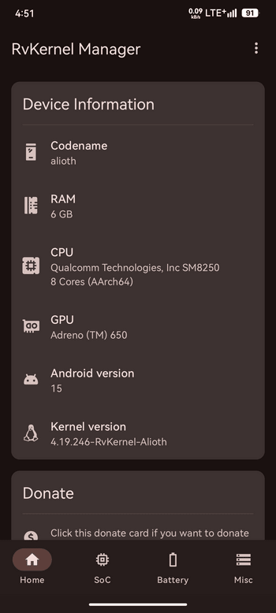
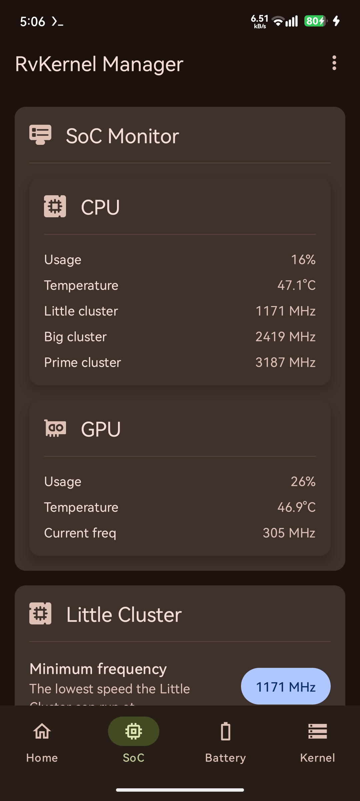
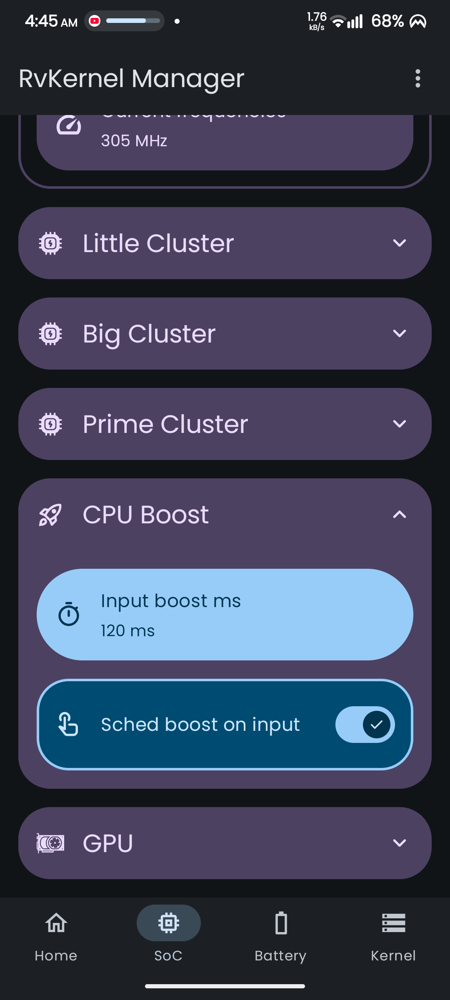
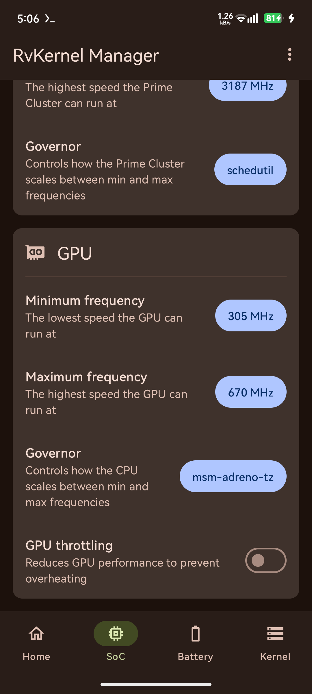
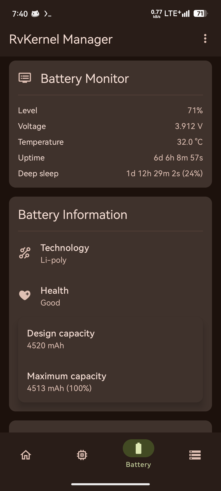
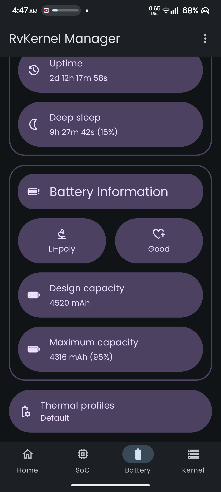

  

# RvKernel Manager

<strong>Take full control of your device's kernel. Tune performance, battery life, and more!</strong>

 

Unlock the true potential of your Android device with <strong>RvKernel Manager</strong>, a powerful and user-friendly open-source tool for managing your kernel settings. Designed for advanced users, this app provides a clean interface to tweak and monitor a wide range of kernel parameters without needing to use a terminal.

 

Fine-tune your device for peak performance, maximum battery life, or a perfect balance between the two.

# Download

## Features

- **Device Information Dashboard**

  Monitor critical device information including CPU model, GPU model, RAM, kernel version, and Android version details.

- **Battery Monitoring & Control**

  Real-time battery monitoring with voltage, temperature, and charging level information. Includes thermal profile management and fast charging control for supported devices.

- **SoC (System on Chip) Management**

  Advanced CPU frequency control with support for different core clusters (Little, Big, Prime). Adjust CPU governors and set minimum/maximum frequencies for each cluster individually.

- **Kernel Parameter Tuning**

  Fine-tune kernel settings including:
  - Scheduler auto group configuration
  - Swappiness control for memory management
  - ZRAM size and compression algorithm settings
  - Kernel printk logging levels
  - Etc

  and there are many other parameters that you can tune!

- **Material 3 Expressive Design Interface**

  Clean, modern interface with support for dynamic theming and blur effects.

## Screenshots

  
  

## Requirements

- **ROOTED** device
- Android 12+
- For now only suitable with Snapdragon devices

## Telegram

- [Channel](https://t.me/rveproject)
- [Group](https://t.me/rve_enterprises)

## License

    Copyright (C) 2025 Rve

    This program is free software: you can redistribute it and/or modify
    it under the terms of the GNU General Public License as published by
    the Free Software Foundation, either version 3 of the License, or
    (at your option) any later version.

    This program is distributed in the hope that it will be useful,
    but WITHOUT ANY WARRANTY; without even the implied warranty of
    MERCHANTABILITY or FITNESS FOR A PARTICULAR PURPOSE.  See the
    GNU General Public License for more details.

    You should have received a copy of the GNU General Public License
    along with this program.  If not, see <https://www.gnu.org/licenses/>.
