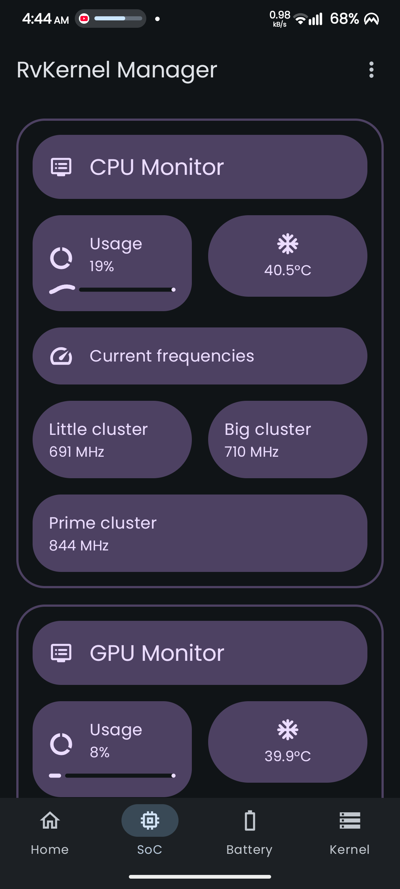
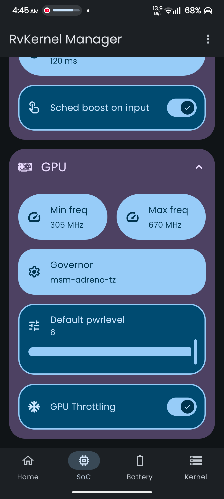
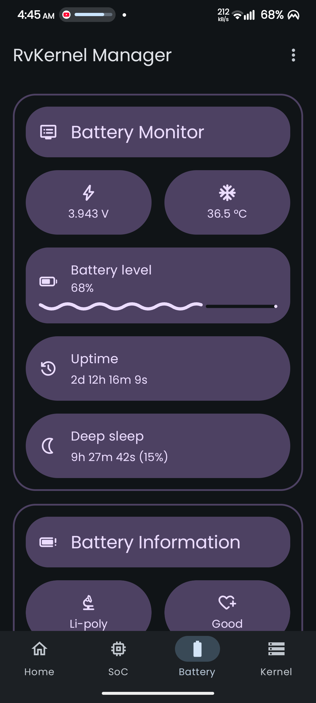

  

# RvKernel Manager

<strong>Take full control of your device's kernel. Tune performance, battery life, and more!</strong>

 

Unlock the true potential of your Android device with <strong>RvKernel Manager</strong>, a powerful and user-friendly open-source tool for managing your kernel settings. This app provides a clean interface to tweak and monitor a wide range of kernel parameters.

 

Fine-tune your device for peak performance, maximum battery life, or a perfect balance between the two.

## Download

## ✨ Features

### 📊 Device Information Dashboard
Monitor critical device information including CPU model, GPU model, RAM, kernel version, Android version, and more.

### 🔋 Battery Monitoring & Control
- **Real-time monitoring**: Voltage, temperature, charging level, and deep sleep time
- **Fast charging control**: Enable/disable for supported devices
- **Bypass charging mode**: Supported on compatible kernels
- **Battery health tracking**: Monitor current health and capacity
- **Thermal configuration**: Manage thermal profiles for optimal performance

### ⚡ SoC (System on Chip) Management
Advanced CPU & GPU control with comprehensive support for:
- **Multi-cluster CPU support**: Little, Big, and Prime core clusters
- **Governor selection**: Choose optimal CPU & GPU scheduling policies
- **Frequency scaling**: Set custom min/max frequencies
- **GPU tuning**: Power level control, Adreno boost, and throttling settings

### 🛠️ Kernel Parameter Tuning
Fine-tune kernel settings for optimal performance:
- **Memory management**: Swappiness, dirty ratio, and ZRAM configuration
- **ZRAM optimization**: Size allocation and compression algorithm selection
- **Network tuning**: TCP congestion control algorithm selection
- **Scheduling**: Kernel task scheduler tuning with BORE scheduler support
- **Kernel profiles**: Pre-configured profiles (Performance, Balance, Powersave)
- **CPU tuning**: Uclamp settings for fine-grained CPU performance control
- **And many more advanced parameters!**

### 🎨 Material 3 Expressive Design
- **Modern interface**: Clean, intuitive Material 3 design
- **Dynamic theming**: Adapts to your system colors
- **Dark/Light modes**: Full theme support

### 🔒 System Integration
- **WireGuard support**: Monitor WireGuard kernel module status
- **Real-time monitoring**: CPU usage, uptime, and system metrics

## 📱 Screenshots (v1.2.5)

  
  

## 📋 Requirements

- ⚠️ **ROOT ACCESS REQUIRED** - This app needs root permissions to modify kernel parameters
- 📱 **Android 12+** - Minimum supported Android version
- 🔧 **Snapdragon devices** - Currently only compatible with Qualcomm Snapdragon SoCs

## Contributing

Contributions to RvKernel Manager are welcome!  Please see [CONTRIBUTING.md](CONTRIBUTING.md) for guidelines on how to contribute.

## Telegram

- [Channel](https://t.me/rveproject)
- [Group](https://t.me/rve_enterprises)

## Credits
- RvKernel Manager icon & banner by [Alister Grey](https://t.me/allisterhellground)

## License

    Copyright (C) 2025 Rve

    This program is free software: you can redistribute it and/or modify
    it under the terms of the GNU General Public License as published by
    the Free Software Foundation, either version 3 of the License, or
    (at your option) any later version.

    This program is distributed in the hope that it will be useful,
    but WITHOUT ANY WARRANTY; without even the implied warranty of
    MERCHANTABILITY or FITNESS FOR A PARTICULAR PURPOSE.  See the
    GNU General Public License for more details.

    You should have received a copy of the GNU General Public License
    along with this program.  If not, see <https://www.gnu.org/licenses/>.
